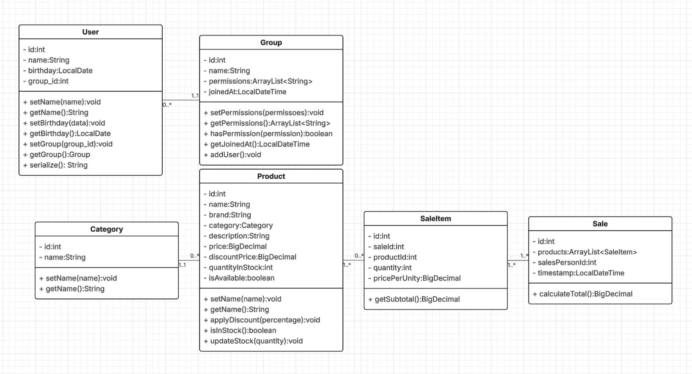

# Programação Orientada a Objetos
**Universidade do Estado do Pará**    
**Alunos:**
- [Felipe Raphael Coelho dos Santos](https://www.linkedin.com/in/frcelipe7/);
- [Gabryel Alves da Costa](https://www.linkedin.com/in/gabryel-alves/);
- [Joanderson Rocha Santos](https://www.linkedin.com/in/joandesson-santos-9418b421a/);
- [José Ribamar Costa Sousa Neto](https://www.linkedin.com/in/jose-ribamar-081ba5290/);

Olá! Neste repositório você encontrará todo o código criado para uma atividade da disciplina de Programação Orientada a Objetos II.
O trabalho é codificar a modelagem do diagrama de classes desenvolvido na disciplina de Análise e Projeto de Algorítmo.

Você pode visualizar o modelo na imagem e, logo abaixo, você encontrará a explicação do modelo proposto.

## Diagrama de Classes do Projeto
O sistema foi modelado utilizando os princípios da Programação Orientada a Objetos, resultando em um conjunto de classes
interconectadas que representam as entidades e funcionalidades principais. A seguir, apresentamos uma brave descrição
de cada classe e seus relacionamentos, conforme visualizado no diagrama de classes fornecido.

O sistema consiste em uma loja de hardware e tem o objetivo de gerenciar o estoque, vendas e gerar
relatórios com base nos dados gerados a partir destas operações para auxiliar na tomada de decisões.

### Entidades Principais e Seus Papéis
Foram desenvolvidadas algumas classes para este sistema: `User`, `Group`, `Product`, `Category`, `SaleItem` e `Sale`.
Cada uma dessas classes encapsula dados e comportamentos específicos, contribuindo para a organização e modularidade do código.

#### - Class`User`
A classe `User` representa os usuários do sistema. A relação entre `User` e `Group` indica que um usuário pode pertencer a
um grupo, e um grupo pode conter múltiplos usuários (relação de zero ou muitos para um e um).

| Atributo   | Tipo      | Descrição                      |
|------------|-----------|--------------------------------|
| - id       | int       | Identificador único do usuário |
| - name     | String    | Nome do usuário                |
| - birthday | LocalDate | Data de nascimento do usuário  |
| - group_id | int       | ID do grupo ao qual pertence   |

| Método                       | Retorno   | Descrição                               |
|------------------------------|-----------|-----------------------------------------|
| setName(name: String)        | void      | Define o nome do usuário                |
| getName(): String            | String    | Retorna o nome do usuário               |
| setBirthday(data: LocalDate) | void      | Define a data de nascimento do usuário  |
| getBirthday(): LocalDate     | LocalDate | Retorna a data de nascimento do usuário |
| setGroup(group_id: int)      | void      | Define o grupo do usuário               |
| getGroup(): Group            | Group     | Retorna o objeto do grupo do usuário    |

#### - Class `Group`
A classe `Group` define os grupos de usuários. Um grupo representa uma função/cargo dentro da empresa. Adicionar um 
usuário a determinado grupo dá a ele determinadas permissões e certos níveis de acesso dentro do sistema. Os grupos disponíveis são:
- Admin (Administrador);
- SalesPerson (Vendedor);
- StockManager (Gerente de estoque);
- SalesAnalyst (Analista de vendas);

| Atributo      | Tipo                | Descrição                                      |
|---------------|---------------------|------------------------------------------------|
| - id          | int                 | Identificador único do grupo                   |
| - name        | String              | Nome do grupo                                  |
| - permissions | ArrayList<String>   | Lista de permissões do grupo                   |
| - joinedAt    | LocalDateTime       | Data e hora em que o usuário entrou no grupo   |

| Método                                        | Retorno           | Descrição                                           |
|-----------------------------------------------|-------------------|-----------------------------------------------------|
| setPermissions(permissoes: ArrayList<String>) | void              | Define as permissões do grupo                       |
| getPermissions(): ArrayList<String>           | ArrayList<String> | Retorna a lista de permissões do grupo              |
| hasPermission(permission: String): boolean    | boolean           | Verifica se o grupo possui uma permissão específica |
| getJoinedAt(): LocalDateTime                  | LocalDateTime     | Retorna a data e hora de entrada no grupo           |

#### - Class `Product`
A classe Product representa no sistema um produto no estoque da loja. Cada produto é pertencente a uma categoria da classe `Category`.

| Atributo          | Tipo     | Descrição                           |
|-------------------|----------|-------------------------------------|
| - id              | int      | Identificador único do produto      |
| - name            | String   | Nome do produto                     |
| - brand           | String   | Marca do produto                    |
| - category        | Category | Categoria à qual o produto pertence |
| - description     | String   | Descrição do produto                |
| - price           | double   | Preço do produto                    |
| - quantityInStock | int      | Quantidade do produto em estoque    |
| - isAvailable     | boolean  | Indica se o produto está disponível |

| Método                            | Retorno | Descrição                              |
|-----------------------------------|---------|----------------------------------------|
| setName(name: String)             | void    | Define o nome do produto               |
| getName(): String                 | String  | Retorna o nome do produto              |
| applyDiscount(percentage: double) | void    | Aplica um desconto ao preço do produto |
| isInStock(): boolean              | boolean | Verifica se o produto está em estoque  |
| updateStock(quantity: int)        | void    | Atualiza a quantidade em estoque       |

#### - Class `Category`
A classe `Category` serve para classificar os produtos. A relação entre `Category` e `Product` é de um para muitos, significando
que uma categoria pode agrupar diversos produtos, mas um produto pertence a apenas uma categoria.

| Atributo | Tipo   | Descrição                        |
|----------|--------|----------------------------------|
| - id     | int    | Identificador único da categoria |
| - name   | String | Nome da categoria                |

| Método                | Retorno | Descrição                     |
|-----------------------|---------|-------------------------------|
| setName(name: String) | void    | Define o nome da categoria    |
| getName(): String     | String  | Retorna o nome da categoria   |

### Gerenciamento de Vendas

O processo de venda é modelado pelas classes `SaleItem` e `Sale`.

#### - Class `SaleItem`
A classe `SaleItem` representa um item individual dentro de uma venda. Cada `SaleItem` possui um `id`, o identificador 
da venda à qual pertence (`saleId`), o identificador do produto (`productId`), a quantidade vendida (`quantity`) e o 
preço unitário no momento da venda (`pricePerUnity`). Um método importante é o `getSubtotal():double`, que calcula o 
valor total para aquele item específico (quantidade multiplicada pelo preço unitário). Um produto pode estar presente em
múltiplos itens de venda (relação de zero ou muitos para um ou muitos).

| Atributo        | Tipo   | Descrição                                     |
|-----------------|--------|-----------------------------------------------|
| - id            | int    | Identificador único do item da venda          |
| - saleId        | int    | ID da venda à qual o item pertence            |
| - productId     | int    | ID do produto vendido                         |
| - quantity      | int    | Quantidade do produto vendido                 |
| - pricePerUnity | double | Preço unitário do produto no momento da venda |

| Método                | Retorno | Descrição                                |
|-----------------------|---------|------------------------------------------|
| getSubtotal(): double | double  | Calcula o subtotal do item (preço * qtd) |

#### - Class `Sale`
A classe `Sale` consolida os itens de uma transação. Ela contém um `id` para a venda, uma lista de `SaleItem` que compõem 
a venda (`products` do tipo `ArrayList<SaleItem>`), o identificador do vendedor (`salesPersonId`) e o momento em que a venda 
foi realizada (`timestamp` do tipo `LocalDateTime`). A principal funcionalidade exposta é o método `calculateTotal():double`, 
responsável por calcular o valor total da venda somando os subtotais de todos os `SaleItem` associados. Uma venda deve conter 
pelo menos um `SaleItem` (relação de um ou muitos para um ou muitos).

Essa estrutura de classes permite uma representação organizada e coesa das diferentes partes do sistema, facilitando o 
desenvolvimento, manutenção e extensão das funcionalidades relacionadas à gestão de usuários, produtos e vendas.

Dá um 10 pra nós aí prof.